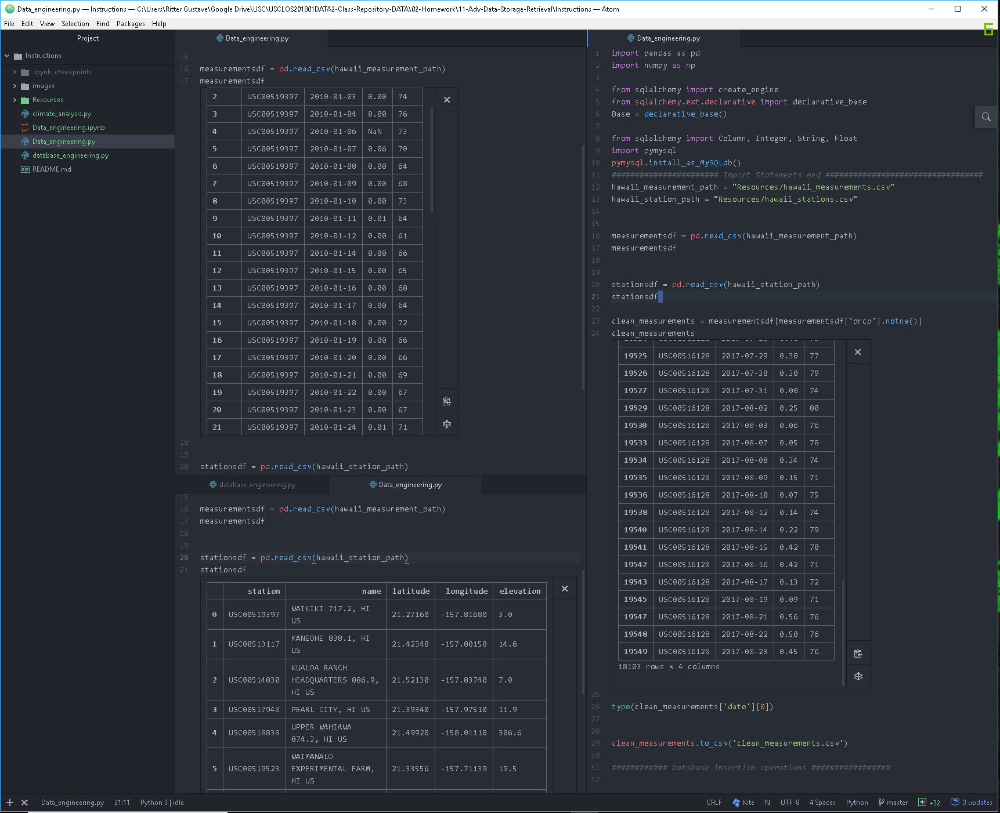

# Hawaii-climate-analysis

 

<h2>Analysis was done using Hydrogen + Atom instead of jupyter-notebook</h2>

Hydrogen runs with the jupyter-notebook kernel so code is interactive like python notebook

